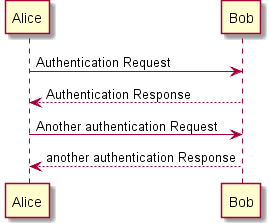
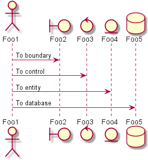
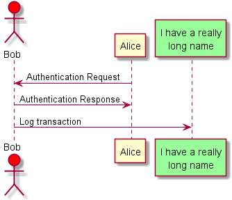

##1.顺序图

###1.1 简单示例
在PlantUML中参与者不用明确地定义, 我们使用序列符号"->" 来绘制两个参与者之间的消息.
> 如果想绘制虚线可以使用 "- ->"
> 同样的可以使用 "<-" 与 "<- -" 来改善可读性.

代码清单1.1

	@startuml
	Alice -> Bob: Authentication Request
	Bob --> Alice: Authentication Response
	Alice -> Bob: Another authentication Request
	Alice <-- Bob: another authentication Response
	@enduml

###1.2 注释
在PlantUML中所有以符号 `'` 开头的都是注释.
多行注释采用 `/'` 开始  `'/` 结尾的形式.

###1.3 定义参与者
我们可以使用关键字来改变参与者，并且可以使用其他的关键字来定义参与者。

- actor
- boundary
- control
- entity
- database

代码清单1.3_1

	@startuml
	actor Foo1
	boundary Foo2
	control Foo3
	entity Foo4
	database Foo5
	Foo1 -> Foo2 : To boundary
	Foo1 -> Foo3 : To control
	Foo1 -> Foo4 : To entity
	Foo1 -> Foo5 : To database
	@enduml

你还可以使用关键字重命名参与者，同样你可以修改参与者的背景颜色.

代码清单1.3_2

	@startuml
	actor Bob #red
	' The only difference between actor
	'and participant is the drawing
	participant Alice
	participant "I have a really\nlong name" as L #99FF99
	/' You can also declare:
	participant L as "I have a really\nlong name" #99FF99
	'/
	Alice ->Bob: Authentication Request
	Bob ->Alice: Authentication Response
	Bob ->L: Log transaction
	@enduml

###1.4 Use non-letters in 

###1.5 Message to Self

###1.6 Change arrow style

###1.7 Change arrow color

###1.8 Message sequence numbering

###1.9 Title

###1.10 Legend the diagram

###1.11 Splitting diagrams

###1.12 Grouping message

###1.13 Notes on messages

###1.14 Some other notes

###1.15 Creole and HTML

###1.16 Divider

###1.17 Reference

###1.18 Delay

###1.19 Space

###1.20 Lifeline Activation and Destruction

###1.21 Participant creation

###1.22 Incoming and outgoing messages

###1.23 Stereotypes and Spots

###1.24 More information on titles

###1.25 Participants encompass

###1.26 Removing Footer

###1.27 Skinparam